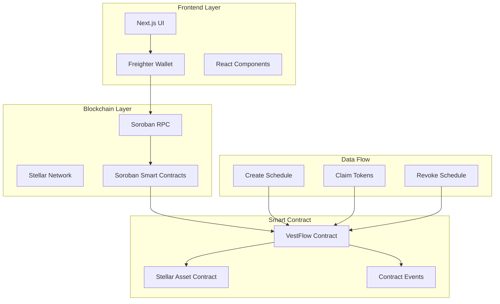
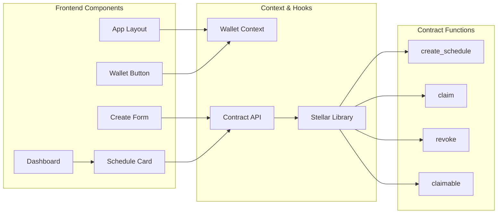
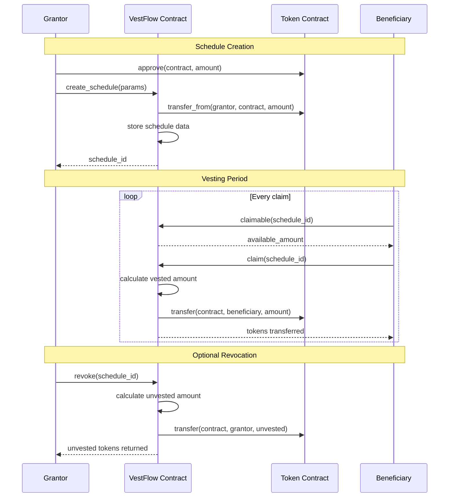

# VestFlow

[](https://github.com/vestflow-labs/vestflow/actions/workflows/ci.yml)
[](https://codecov.io/gh/vestflow-labs/vestflow)

**Trustless token vesting schedules on Stellar / Soroban.**

VestFlow lets anyone lock tokens into a smart contract and release them to a beneficiary over time — linearly or all-at-once after a cliff. No custodian, no multisig, no trust required.

Live on **Stellar Testnet** · Contract: `CCZ6AE75C27DMB3SOIHK7WZSBUG3NQPVLHSVEBQ2FSAEVGRJ5TXAZWCX`

---

## Architecture

### System Overview



### Component Architecture



### Vesting Flow Diagram



---

## What it does

| Feature | Details |
|---|---|
| Linear vesting | Tokens unlock continuously from `start_time` to `start_time + duration` |
| Cliff vesting | No tokens unlock until the cliff date, then the full amount unlocks at once |
| **Linear+Cliff vesting** | No tokens until the cliff, then linear release from cliff to end date (typical employee schedule) |
| Revocable schedules | Grantor can cancel mid-flight; unvested tokens return to grantor, already-vested tokens stay claimable |
| Irrevocable schedules | Once created, the grantor has no way to claw back tokens |
| Multi-schedule | A single wallet can be grantor or beneficiary on unlimited independent schedules |
| On-chain events | `created`, `claimed`, and `revoked` events emitted for indexers |
| Bulk claimable query | Fetch all claimable amounts in one RPC simulation via `claimable_bulk` |

---

## How it works

```
Grantor approves contract → create_schedule() → tokens locked in contract
                                                        │
                              ┌─────────────────────────┘
                              ▼
                     vesting clock starts
                              │
               ┌──────────────┴──────────────┐
               │ Linear                       │ Cliff
               │ tokens drip every second     │ 0 until cliff date
               │                              │ then 100% unlocks
               └──────────────┬──────────────┘
                              ▼
                   beneficiary calls claim()
                   → vested - already_claimed
                       transferred to wallet
```

When a grantor revokes a revocable schedule the contract calculates exactly how much has vested at that moment. The vested portion stays locked for the beneficiary to claim; the unvested portion is immediately returned to the grantor.

---

## Tech stack

| Layer | Technology |
|---|---|
| Smart contract | Rust · [soroban-sdk](https://crates.io/crates/soroban-sdk) v22 |
| Blockchain | Stellar Testnet · Soroban RPC |
| Frontend | Next.js 15 · TypeScript · Tailwind CSS v4 |
| Wallet | Freighter browser extension (`@stellar/freighter-api` v6) |
| Stellar SDK | `@stellar/stellar-sdk` v15 |
| Token standard | Stellar Asset Contract (SAC) — native XLM |

---

## Repository structure

```
vestflow/
├── contracts/
│   └── vestflow/
│       ├── Cargo.toml
│       └── src/
│           └── lib.rs          # Full Soroban contract
├── lib/
│   ├── stellar.ts              # Contract interaction helpers + types
│   └── WalletContext.tsx       # React wallet state context
├── components/
│   ├── Navbar.tsx
│   ├── WalletButton.tsx
│   ├── ScheduleCard.tsx        # Displays one schedule with claim/revoke
│   └── CreateForm.tsx          # Create-schedule form
├── app/
│   ├── layout.tsx              # Root layout — wraps WalletProvider
│   ├── globals.css             # Dark theme design system
│   ├── page.tsx                # Landing page
│   └── app/
│       ├── page.tsx            # Dashboard — your schedules
│       └── create/
│           └── page.tsx        # New schedule form
├── .env.local.example          # Required env vars
└── README.md
```

---

## Contract reference

### `VestingKind` enum

| Variant | Behaviour |
|---|---|
| `Linear` | Tokens drip linearly from `start_time` to `start_time + duration`. `cliff_duration` is ignored. |
| `Cliff` | No tokens until `start_time + cliff_duration`; then the full amount unlocks at once. |
| `LinearWithCliff` | No tokens before `start_time + cliff_duration`; linear release from the cliff date to `start_time + duration`. Models the classic 1-year cliff + 3-year linear employee schedule. |

### `create_schedule`

```rust
pub fn create_schedule(
    env: Env,
    grantor: Address,       // must sign the transaction
    beneficiary: Address,   // who receives the vested tokens
    token: Address,         // SAC address of the token
    total_amount: i128,     // in base units (stroops for XLM)
    start_time: u64,        // unix timestamp
    duration: u64,          // seconds
    cliff_duration: u64,    // seconds from start_time (0 for no cliff)
    kind: VestingKind,      // Linear | Cliff | LinearWithCliff
    revocable: bool,
) -> u64                    // returns the new schedule ID
```

The grantor must have already called `token.approve(contract, total_amount)` before calling this. Tokens are transferred into the contract atomically in the same transaction.

### `claim`

```rust
pub fn claim(env: Env, schedule_id: u64)
```

Called by the beneficiary. Transfers `vested_amount - already_claimed` from the contract to the beneficiary wallet.

### `revoke`

```rust
pub fn revoke(env: Env, schedule_id: u64)
```

Grantor-only. Marks the schedule revoked and returns the unvested portion to the grantor. Only valid on revocable schedules that have not already been revoked.

### `claimable`

```rust
pub fn claimable(env: Env, schedule_id: u64) -> i128
```

Read-only. Returns how many base units are currently claimable for `schedule_id`. Returns `0` for unknown IDs (does not panic).

### `claimable_bulk`

```rust
pub fn claimable_bulk(env: Env, ids: Vec<u64>) -> Vec<i128>
```

Read-only. Returns claimable amounts for every ID in `ids` in a **single** simulation round-trip. Results are in the same order as the input; unknown IDs return `0`. Use this from the dashboard instead of calling `claimable` once per schedule.

### `get_schedule`

```rust
pub fn get_schedule(env: Env, schedule_id: u64) -> VestingSchedule
```

Read-only. Returns the full schedule struct.

### `schedule_count`

```rust
pub fn schedule_count(env: Env) -> u64
```

Read-only. Returns the total number of schedules ever created.

### Error messages

The contract panics with plain strings that callers can match on. All public-facing error strings are documented here.

| Error string | Triggered by |
|---|---|
| `"Schedule not found"` | `get_schedule`, `claim`, or `revoke` called with an unknown ID |
| `"Nothing to claim yet"` | `claim` called before any tokens have vested |
| `"Schedule has been revoked"` | `claim` called on a schedule that was already revoked |
| `"Schedule is not revocable"` | `revoke` called on an irrevocable schedule |
| `"Already revoked"` | `revoke` called a second time on the same schedule |
| `"Amount must be positive"` | `create_schedule` with `total_amount` ≤ 0 |
| `"Duration must be positive"` | `create_schedule` with `duration` = 0 |
| `"Cliff cannot exceed duration"` | `create_schedule` with `cliff_duration` > `duration` |
| `"Beneficiary must differ from grantor"` | `create_schedule` with `beneficiary == grantor` |

---

## Getting started

### Prerequisites

- [Node.js](https://nodejs.org) ≥ 18
- [Rust](https://rustup.rs) + `wasm32v1-none` target
- [Stellar CLI](https://developers.stellar.org/docs/tools/developer-tools/cli/install-cli)
- [Freighter wallet](https://freighter.app) browser extension (set to Testnet)

### Run the frontend

```bash
# 1. Clone
git clone https://github.com/libby-coder/vestflow.git
cd vestflow

# 2. Install dependencies
npm install

# 3. Set up environment
cp .env.local.example .env.local
# The example already contains the deployed testnet contract address

# 4. Start dev server
npm run dev
```

Open [http://localhost:3000](http://localhost:3000) and connect Freighter (Testnet).

---

## Build and test the contract

```bash
cd contracts/vestflow

# Run all tests
cargo test

# Build the WASM (output: target/wasm32v1-none/release/vestflow.wasm)
cargo build --target wasm32v1-none --release
```

Contract CI also tracks release Wasm size and the worst-case storage entries touched when a schedule is created:

```bash
npm run contracts:metrics
```

The current storage benchmark for `create_schedule` is 4 instance-storage entries: the schedule record, schedule count, grantor schedule index, and beneficiary schedule index.

### Contract TypeScript bindings

Typed contract bindings are generated from the release Wasm and committed under `lib/bindings/vestflow`.

```bash
npm run bindings:generate
npm run bindings:build
```

CI regenerates the bindings and fails if the generated files drift from the committed ABI.

The test suite covers:

| Test | What it verifies |
|---|---|
| `test_linear_vesting_full_claim` | Partial claim at 50%, full claim at 100% |
| `test_cliff_vesting` | 0 claimable before cliff, full amount after |
| `test_revoke_returns_unvested` | Grantor gets back exactly the unvested portion |
| `test_cannot_claim_before_vesting_starts` | Panics with "Nothing to claim yet" |
| `test_cannot_revoke_irrevocable` | Panics with "Schedule is not revocable" |

---

## Deploy to testnet

```bash
# 1. Generate and fund a deployer keypair
stellar keys generate deployer --network testnet
stellar keys fund deployer --network testnet

# 2. Deploy the contract
stellar contract deploy \
  --wasm target/wasm32v1-none/release/vestflow.wasm \
  --source deployer \
  --network testnet

# Copy the output contract address and paste it into .env.local:
# NEXT_PUBLIC_CONTRACT_ID=<your-contract-id>
```

---

## Deploy to mainnet

Before deploying to mainnet, work through the checklist below.

### Mainnet deployment checklist

- [ ] **Security audit** — contract code reviewed internally or by a third party
- [ ] **Immutability decision** — the contract has no upgrade path; confirm this is intentional for mainnet
- [ ] **Deployer key management** — hardware wallet or secure offline key; never store the private key in plaintext
- [ ] **Environment variables** — set `NEXT_PUBLIC_NETWORK=mainnet` and the mainnet contract/token addresses in `.env.local`
- [ ] **CSP** — verify `next.config.ts` allows the mainnet RPC endpoint (`https://mainnet.sorobanrpc.com`)
- [ ] **Smoke test** — run `scripts/deploy-mainnet.sh` on a staging environment first

### Running the mainnet deploy script

```bash
chmod +x scripts/deploy-mainnet.sh

# Set the name of your funded Stellar CLI key:
DEPLOYER_KEY=my-mainnet-key ./scripts/deploy-mainnet.sh
```

The script builds the WASM, prompts for confirmation, deploys, and prints the contract ID to add to `.env.local`.

Each deploy script records successful deployments in [DEPLOYMENTS.md](DEPLOYMENTS.md). Set `VERSION=vX.Y.Z` when deploying a tagged release, and use `UPDATE_DEPLOYMENTS=0` to skip registry updates for dry runs or one-off experiments.

---

## CLI usage examples

Interact with the deployed contract directly from the terminal:

```bash
# Check how many schedules exist
stellar contract invoke \
  --id CCZ6AE75C27DMB3SOIHK7WZSBUG3NQPVLHSVEBQ2FSAEVGRJ5TXAZWCX \
  --network testnet \
  --source alice \
  -- schedule_count

# Preview claimable amount for schedule #1
stellar contract invoke \
  --id CCZ6AE75C27DMB3SOIHK7WZSBUG3NQPVLHSVEBQ2FSAEVGRJ5TXAZWCX \
  --network testnet \
  --source alice \
  -- claimable --schedule_id 1

# Claim vested tokens
stellar contract invoke \
  --id CCZ6AE75C27DMB3SOIHK7WZSBUG3NQPVLHSVEBQ2FSAEVGRJ5TXAZWCX \
  --network testnet \
  --source beneficiary-key \
  -- claim --schedule_id 1
```

---

## Security design

- **No admin key.** There is no privileged owner address. The contract has no upgrade path — what is deployed is what runs.
- **Grantor authorization enforced on-chain.** `create_schedule` and `revoke` both call `grantor.require_auth()`, so the Stellar protocol itself enforces who can call these functions.
- **Beneficiary authorization on claim.** `claim` calls `beneficiary.require_auth()` — no third party can trigger a claim on behalf of a beneficiary.
- **Atomic token transfer.** Tokens are pulled from the grantor in the same transaction that creates the schedule. There is no window where the schedule exists but is not funded.
- **Integer arithmetic only.** The vesting math uses integer division with no floating point. Rounding always favours the contract (floors down), protecting the grantor from dust accumulation attacks.
- **Revocable flag is immutable.** Once a schedule is created as irrevocable, there is no function that can change that.

---

## Contributing

Contributions are welcome! See [CONTRIBUTING.md](CONTRIBUTING.md) for details.

Good first issues are labelled [`good first issue`](https://github.com/libby-coder/vestflow/issues?q=label%3A%22good+first+issue%22) on GitHub.

---

## Roadmap

- [ ] ERC-20 / SEP-41 arbitrary token support (currently XLM only)
- [ ] Vesting schedule NFT receipt tokens
- [ ] Batch schedule creation
- [x] Linear+Cliff hybrid vesting kind
- [x] `claimable_bulk` for dashboard efficiency
- [x] Error messages documented in contract spec and README
- [x] Mainnet deployment checklist + `scripts/deploy-mainnet.sh`
- [ ] Subgraph / event indexer
- [ ] Mobile-friendly dashboard

---

## Resources

- [Soroban documentation](https://developers.stellar.org/docs/smart-contracts)
- [Stellar testnet explorer](https://stellar.expert/explorer/testnet)
- [Freighter wallet](https://freighter.app)
- [soroban-sdk crate](https://crates.io/crates/soroban-sdk)
- [Stellar Asset Contract](https://developers.stellar.org/docs/tokens/stellar-asset-contract)

---

## License

MIT — see [LICENSE](LICENSE).
